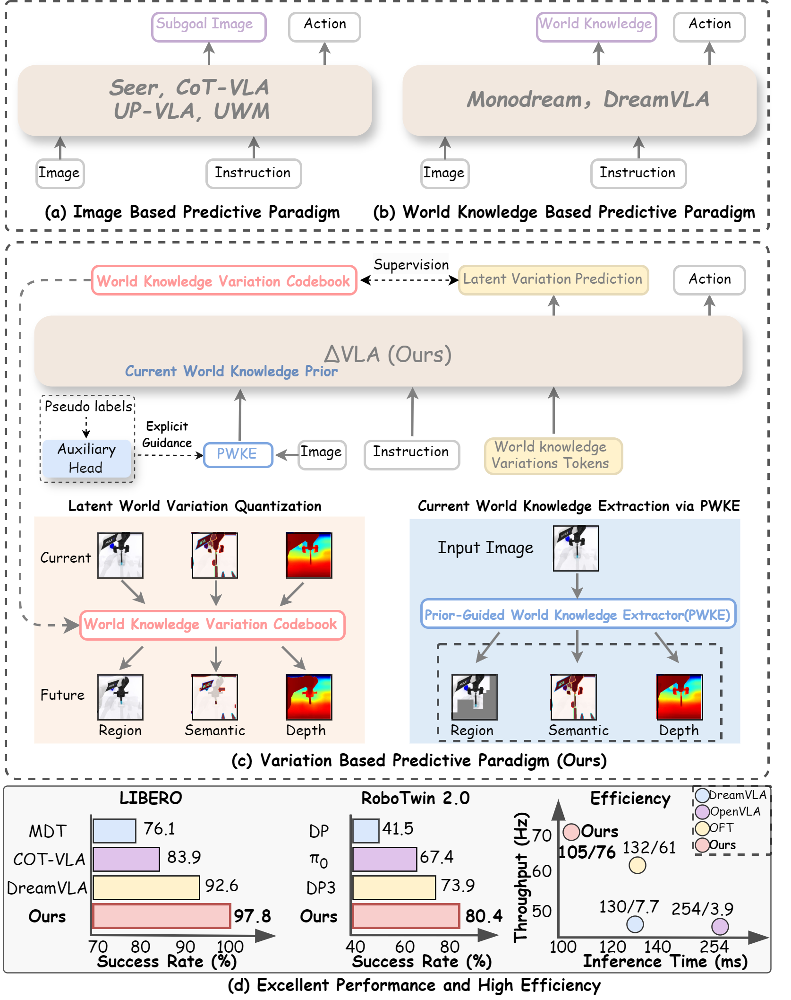

<div align="center">
<h2 class="papername"> ΔVLA: Prior-Guided Vision-Language-Action Models via
World Knowledge Variation </h2>
<div>
    <a href="https://scholar.google.com.hk/citations?user=0GtAUPoAAAAJ&hl=zh-CN&oi=sra" target="_blank">Yijie Zhu</a><sup>1,2</sup>,
    <a href="https://orcid.org/0009-0001-9102-7051" target="_blank">Jie He</a><sup>1</sup>,
    <a href="https://rshaojimmy.github.io/OrionLab/" target="_blank">Rui Shao*</a><sup>1,3</sup>,
    <a href="https://zitongyu.github.io/" target="_blank">Shuo Yang</a><sup>2,5</sup>, 
    <a href="https://zitongyu.github.io/" target="_blank">Pengwei Xie</a><sup>2,5</sup>, 
    <a href="https://zitongyu.github.io/" target="_blank">Jianye HAO</a><sup>2,5</sup>, 
    <a href="https://zitongyu.github.io/" target="_blank">Xiaochen Yuan</a><sup>2,5</sup>, 
    <a href="https://zitongyu.github.io/" target="_blank">Tao Tan</a><sup>2,5</sup>, 
    <a href="https://zitongyu.github.io/" target="_blank">Zitong Yu*</a><sup>2,5</sup>, 
</div>
<sup>1</sup>School of Computer Science and Technology, Harbin Institute of Technology, Shenzhen<br>
<sup>2</sup>Great Bay University
<sup>3</sup>Shenzhen Loop Area Institute
<sup>4</sup>Linyi University<br>
<sup>5</sup>Dongguan Key Laboratory for Intelligence and Information Technology<br>
*Corresponding author<br>

[](https://arxiv.org/abs/2511.17079)

<h3 align="center">
    <strong>
    🛠️ We're still cooking — Stay tuned!🛠️<br>
    ⭐ Give us a star if you like it! ⭐ <br> 
    ✨If you find this work useful for your research, please kindly cite our paper.✨ 
    </strong>
</h3>
</div>

## :fire: Updates
- [11/2025] :fire: [arXiv paper](https://arxiv.org/abs/2511.17079) released!

## :fire: Introduction

**ΔVLA** is a **prior-guided vision‑language‑action model** that reasons about **world knowledge variation** instead of directly predicting future states. Its core idea shifts the learning paradigm **from forecasting absolute outcomes to modeling the process of change**, thereby enhancing causal consistency and efficiency in robotic manipulation. Unlike previous methods that directly predict future images or world states, ΔVLA first constructs an explicit **current‑world knowledge prior** through the **Prior‑Guided World Knowledge Extractor (PWKE)**, which extracts actionable regions, semantic cues, and geometric depth from the visual input. Building on this prior, the model encodes how knowledge evolves under actions via the **Latent World Variation Quantization (LWVQ)**, representing changes in a discrete latent space rather than reconstructing full future modalities. Furthermore, to reduce cross‑modal interference during variation modeling, ΔVLA introduces the **Conditional Variation Attention (CV‑Atten)** mechanism, which isolates attention flows across different knowledge types to promote disentangled causal reasoning.

We also provide a comprehensive comparison of different paradigms for world‑knowledge modeling and robotic control (see below).

<div align="center">

</div>

The overall framework of ΔVLA is illustrated below: given a visual observation and a task instruction, ΔVLA first extracts an explicit **world knowledge prior** via **PWKE**, then encodes world changes into discrete latent variables through **LWVQ**. These prior representations along with the variation tokens are fed into a **large language model**, which performs reasoning internally using a **Conditional Variation Attention (CV‑Atten)** mechanism to ensure disentanglement among semantic, geometric, and regional variations, ultimately generating precise and causally consistent action sequences.consistent action sequences.
<div align="center">

</div>

## 🛠️ Installation
```bash
# Create and activate conda environment
conda create -n deltavla python=3.10 -y
conda activate deltavla

# Clone CogVLA repo and pip install to download dependencies
git clone git@github.com:JiuTian-VL/DeltaVLA.git
cd DeltaVLA
pip install -e .

# Install Flash Attention 2 for training
pip install packaging ninja
ninja --version; echo $?  # Verify Ninja --> should return exit code "0"
pip install "flash-attn==2.5.5" --no-build-isolation
```

### Training

See [LIBERO.md](docs/LIBERO.md) for fine-tuning/evaluating on LIBERO simulation benchmark task suites.

See [ROBOTWIN.md](docs/ROBOTWIN.md) for fine-tuning/evaluating on RoboTwin2.0 simulation benchmark task suites.

See [REAL.md](docs/REAL.md) for fine-tuning/evaluating on real-world galaxea & ALOHA robot tasks.

### Demos

After training, fill your checkpoint path in `demo.py`. Then run the following command:

```bash
CUDA_VISIBLE_DEVICES=0 python demo.py
```

## Videos

https://github.com/user-attachments/assets/c47280c7-0698-490e-8ee0-79980ae299fb


https://github.com/user-attachments/assets/3b42abc9-be44-42ef-b8f3-bb0efc128538

## :pencil: Citation
If you find this work useful for your research, please kindly cite our paper.

```
@inproceedings{zhu2026deltavla,
  title     = {$\Delta$VLA: Prior-Guided Vision-Language-Action Models via World Knowledge Variation},
  author    = {Zhu, Yijie and He, Jie and Shao, Rui and Yang, Shuo and Xie, Pengwei and Hao, Jianye and Yuan, Xiaochen and Tan, Tao and Yu, Zitong},
  booktitle = {Conference on Computer Vision and Pattern Recognition},
  year      = {2026}
}
```
## Acknowledgement
* Lots of code are inherited from [OpenVLA-oft](https://github.com/moojink/openvla-oft). Thanks for this great work.